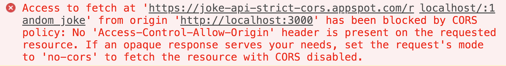
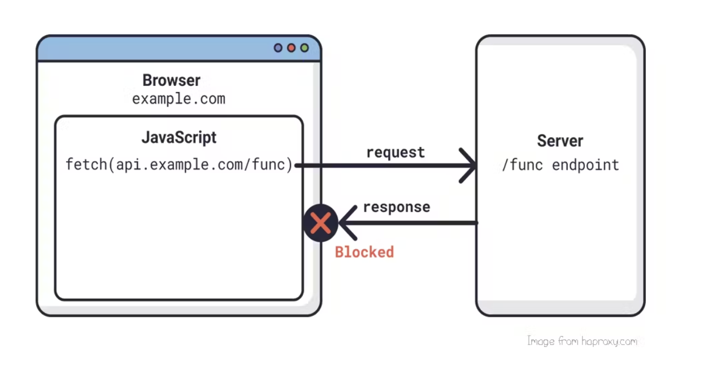
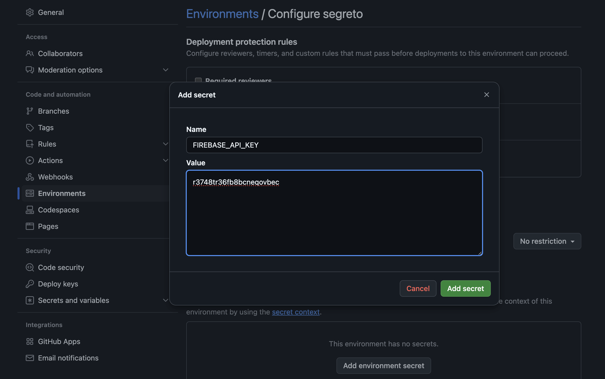
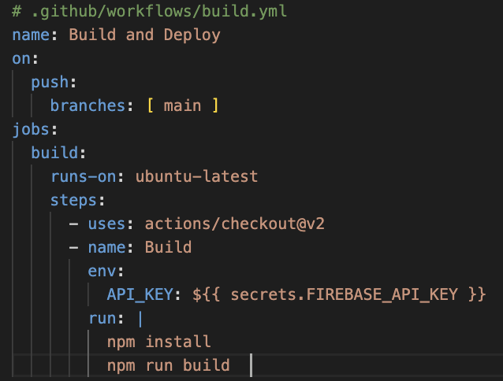
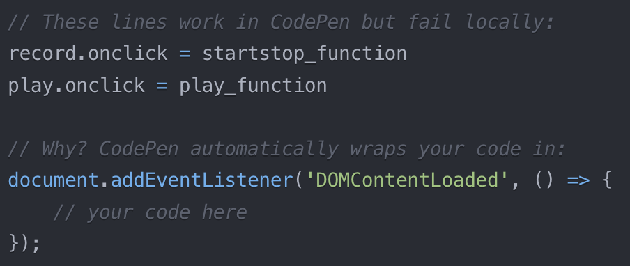

# ACTAM - Addressing common issues
## 18/12/2024

---

## Where do i put my project? Local vs Hosted

- Files are loaded from local folders (file:// or live server plugins)
- Files are served thorugh web servers (http:// , https://)

---

## Ok, let's go with hosting, but static or dynamic?

- Static: Files are served exactly as they are (no backend for processing!)
- Dynamic: Content can be generated/processed dynamically via backends (e.g. python, node.js)

Dynamic also means real-time databases (e.g. Firebase, AWS AppSync)

---

## Cloud storage reality check

*I'll just toss my files in the cloud and share the links directly*

*mm maybe not*

---

## Who are you CORS?

---

## Let's try to meet you...

`const response = await fetch("https://github.com/fbrusch/actam_2024/blob/main/assets/3bodies.png");`

copy&paste the above in the browser inspector

---

## The browser is the boss
### Same Origin Policy:

"only resources from the same domain, host and port can interact with each other"

- Try to think why this is or isn't a good policy

---

#### web apps may need to fetch resources from several different servers
so we need a better protocol ...
### Cross-Origin Resource Sharing

---

[CORS](https://developer.mozilla.org/en-US/docs/Web/HTTP/CORS) enables websites to access resources from servers that does not share its domain

---

## How?

### Whitelist your app domain

On the server side,
pass your website (`actam.com`) to
`Access-Control-Allow-Origin` http request header

(not all requests trigger [CORS preflight](https://developer.mozilla.org/en-US/docs/Glossary/Preflight_request))

---
## CORS issues scenarios

Your frontend tries to fetch resources from a different domain and the server hasn't specified permissions.

1) API calls to different services
2) Loading media from cloud storage
3) Accessing files from content delivery networks (usually not for CDNs hosting libraries)

---

## things to keep in mind

- Can I manage appropriate CORS headers on the server side?
- Are credentials and authentication required?
- Is the service i'm using CORS-friendly for hosting assets?

---

## Tip: use gh pages for hosting assets

- pros: Free HTTPS hosting, built-in CORS support
- cons: Bandwidth limitations

Static hosting alternatives: *Netlify*, *Surge*

--- 

## Secrets and keys, keep them hidden
- ❌ avoid this in the code

`
var firebaseConfig = {
  apiKey: "YOUR_API_KEY",
  ...
`
- ✅ try this (in local development)

`echo ".env" >> .gitignore`

`require('dotenv').config(); // Load .env file
const apiKey = process.env.API_KEY;`

---
### what about after deployment on static hosting?
GH pages doesn't process environment variables server-side.

**inject secrets during the build process**
you'll need a [workflow](https://docs.github.com/en/actions/writing-workflows/about-workflows)

---
### step 1

---

### step 2

---

## CodPen hidden trap

- Masks browser compatibility issues
- Handles cross-origin issues behind the scenes
- **Automatically wraps js in DOMContentLoaded**

---

## thank you Codepen for

1) preventing errors caused by trying to access elements or modify the DOM before it's ready
2) avoiding timing issues
3) a smooth and error-free interaction with the DOM

---

## But

DOM elements return null when served locally

- takeaway: Don't rely too much on CodePen's automatic behaviors

---

