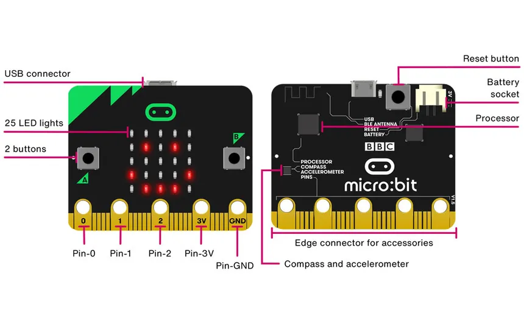

# ACTAM - Embedded programming with MicroBit
## 04/12/2024

---

## What is embedded programming? And what does it take?

- The process of developing software for embedded systems
- Specialized hardware and IDEs, 
- ... not really our topic, is it?

---

## What if we had a device that can be programmed to

- control our music applications
- be the music application itself 
- ... now we're talking!

---

## Two paths

1) Leverage sensors to input external data (good ol' theremin) 
2) Portable audio synthesis (better with a DAC)

---

## What is a microcontroller and how can be useful?

An integrated circuit with contrained resources that govern specific operations

1) Create custom MIDI controllers
2) Enhance interactivity with music application

---

## What does it look like

---

## Entry-level Features

- Buttons: programmable buttons (A, B and A+B)
- Sensors: accelerometer, compass, and temperature 
- Connectivity: Usb, Bluetooth Low Energy (BLE) and radio for wireless communication.
- Programming: JavaScript or Python

---

## Where to start

https://makecode.microbit.org/

---

## Goal for today

- Explore the block-based programming and simulation
- Connect and send data to a webapp

---

