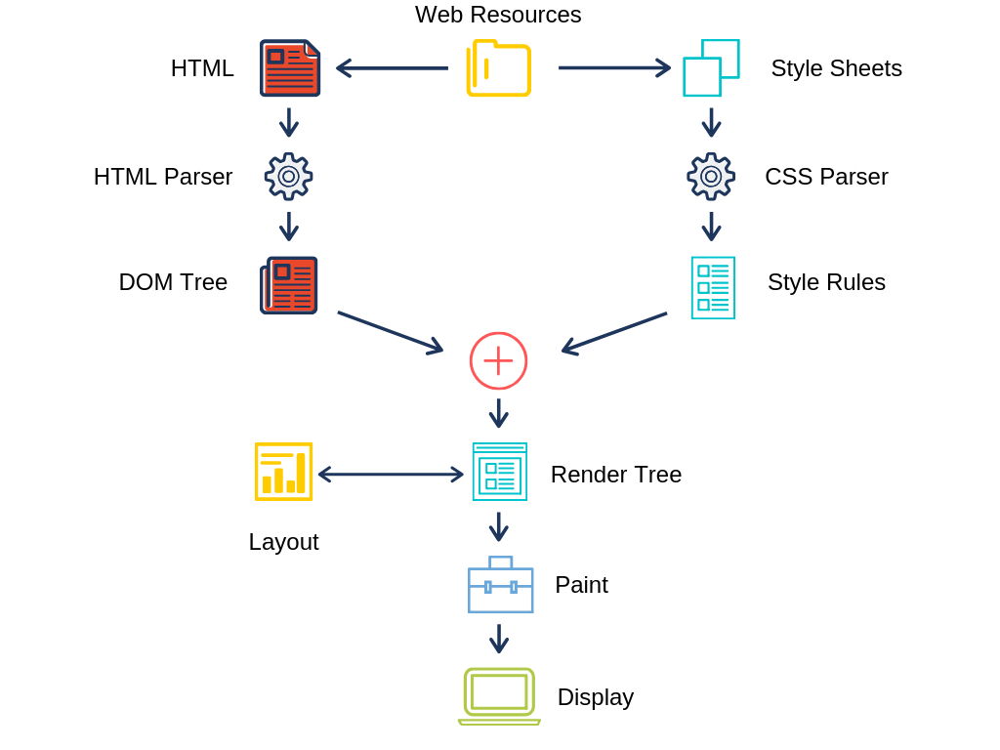

# ACTAM: How to build and deploy a webpage

## 30/09/2024

---

## Class outline

- Short introduction
- In-editor demo
- **Hands-on:** Set-up code editor and work on a webpage

- Break (5 min)

- Demo github pages deployment
- **Hands-on:** Replicate deployment 

---

## Easy goals

- Build a webpage using HTML and CSS
- Deploy it to GitHub Pages

---

## What is a webpage (without JavaScript)?

- A collection of HTML, CSS and assets.
- HTML is the _structure_ , CSS is the _look_ , and the assets are the _content_ of your page.
- You can use any text editor to build a webpage.
- But there's a better way: code editors!

---

## Browser's rendering journey 

1) Rendering engines parse the HTML into a Document Object Model (DOM) tree.
2) A DOM tree is made of nodes ( **elements** 
, 
; **text**; **attributes**)
3) The **rendering engine** builds another tree (Render Tree)
4) Each node of the Render Tree is assigned coordinates that determine where it will appear on the screen
5) Once the layout is computed, the rendering engine paints each node onto the screen based on its visual attributes

---

---

## Common HTML Elements

Headings  `(<h1> to <h6>) `
Division: `
 ... 
`
Paragraphs: `
 ... 
`
Links  `<a href="..."> ... </a>`
Images  `` (self closing)
Lists  `<li> ... </li>`

---

## No "Style," no party: Why CSS Matters

- HTML is just a collection of tags, and tags are not styled by 

---

---

## Three ways to be cool with styles

1) Inline: `
` (Avoid for large projects)
2) Internal: `` (Good for single-page projects)
3) External: `<link rel="stylesheet" href="filename.css">` (Scalable code across multiple pages)
