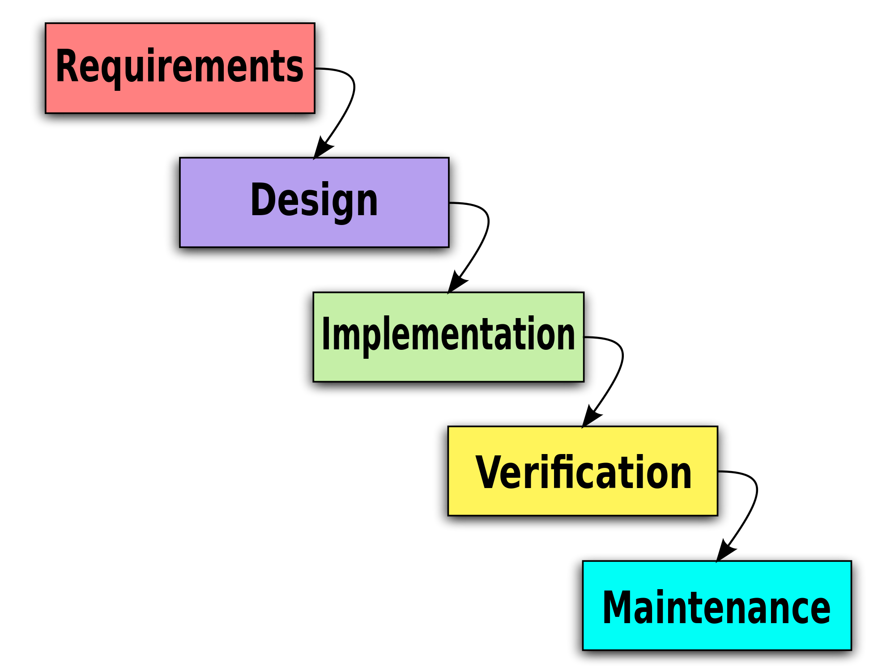

# Advanced Coding Tools and Methodologies (ACTAM)

## Academic Year 2024/2025

---

## Course Overview

- Title: "Advanced Coding Tools and Methodologies"
- Exploring the concept of "coding" beyond traditional programming
- Focus on sound and music as the main application context
- Developing cognition and taste for programming languages possibilities

---

## What is Coding?

- More general than "programming", involves programming languages
- No precise definition, but related to "programming languages"
- Programming: using programming languages (that are linguistic/mathematical tools) to create applications
- A programming language is a formalism/language "understandable" by a computer

---

## Traditional View of Programming

- Often seen as translating application behavior into a programming language
- Captured in software engineering by the waterfall model
- This role potentially replaceable by LLMs in the future

  

---

## Beyond Traditional Programming

- Data analysis (e.g., MATLAB, R, Python)
- Automation
- Simulations and world-building
- Mathematical problem-solving and theorem proving
- Idea prototyping
- Educational purposes (computational thinking)
- Live music performance

---

## Coding as a Thought Tool

- In some applications, languages are a tool for thinking
- This course explores less usual possibilities offered by programming languages
- Objective: Develop cognition for what can be done with programming languages

---

## Course Focus: Sound and Music

- Chosen to anchor and orient the vast horizon of applications
- Will discuss musical applications, live coding, programming physical control devices
- Example of unusual use in music: https://www.youtube.com/watch?v=yY1FSsUV-8c

---

## Course Structure

1. "Coding and Sound" Module (Francesco Bruschi)
   - Exploring various programming languages without exhaustive depth
   - Practical approach to programming possibilities
   - Using sound/music as the main application context

2. Web Development Module (Vincenzo Rana)
   - HTML5 (HTML, CSS, JavaScript)
   - (Details to be expanded)

---

## "Coding and Sound" Module Details

- Live coding for music/sound performance
- Programming musical web applications (e.g., drum machines, sequencers)
  - Web Audio API
  - Tone.js and other libraries
- Programming cyber-physical systems for controllers or synthesizers
  - Microbit, ESP32

---

## Languages and Tools

- Python, JavaScript, Ruby
- Web development tools
- Version control systems (e.g., Git)
- Databases

---

## Course Objectives

- Increase coding proficiency for beginners
- Explore new programming potentials for experienced coders
- Learn useful tools beyond just programming

---

## Evaluation Method

- Project-based assessment
- Frequent optional exercises/experiments (after each lesson)
- Small hackathons/group exercises for extra points
- Full grade achievable through the final project alone

---

## Project Guidelines

- Web-based applications using course concepts
- Freedom in project choice
- Possible project ideas from renowned musicians
- Group presentations during exams
- Code and documentation submission via GitHub
- Documentation as a GitHub site

---

## Project Guidelines

- Web-based applications using course concepts
- Freedom in project choice
- Possible project ideas from renowned musicians
- Group presentations during exams
- Code and documentation submission via GitHub
- Documentation as a GitHub site

---

## Project Evaluation Criteria

- Technical Implementation (30%)
- Creativity and Innovation (20%)
- User Experience and Interface Design (15%)
- Integration of Course Concepts (15%)
- Project Complexity and Ambition (10%)
- Documentation and Presentation (10%)
- Bonus Points available

---

## Technical Implementation (30%)

- Correct use of programming languages and technologies covered in the course
- Code quality and organization
- Effective use of audio programming concepts and techniques
- Implementation of advanced features or algorithms

---

## Creativity and Innovation (20%)

- Originality of the project idea
- Innovative use of audio technologies
- Creative problem-solving in audio programming challenges

---

## User Experience and Interface Design (15%)

- Intuitive and user-friendly interface
- Responsiveness and performance of the application
- Aesthetic appeal and coherence with audio/musical context

---

## Integration of Course Concepts (15%)

- Demonstration of understanding both "Coding and Sound" and "Web Development" modules
- Effective integration of web technologies with audio processing
- Application of theoretical concepts in a practical context

---

## Project Complexity and Ambition (10%)

- Scope and scale of the project
- Handling of complex audio processing tasks
- Integration of multiple technologies or APIs

---

## Documentation and Presentation (10%)

- Clear explanation of project goals and implementation
- Quality of code documentation
- Effectiveness of project demonstration or presentation

---

## Bonus Points

- Collaboration with Cremona students or integration of specialized audio equipment
- Implementation of real-time audio processing or live coding features
- Integration with external services or APIs related to music/audio

---

## Logistics

- Instructors: Francesco Bruschi, Vincenzo Rana, Marco Esposito
- No rigid distinction between lectures and exercises
- Calendar for instructor schedules and point-earning labs
- In-person attendance encouraged for:
  - Instructor satisfaction
  - More engaging experience
  - Direct assistance during hands-on activities
  - Experiencing the "delightful cacophony of tones and bleeps"

---

## Remote Learning Considerations

- Efforts to involve Cremona classroom
- Asymmetric course structure
- On-site visits for:
  - Replicating hackathons
  - Project support

---

## Course Timeline

- Regular classes and exercises
- Shift towards project assistance towards the end
- More frequent presence of Marco for project support

---

## Software Requirements

- Python
- Sonic Pi
- Web browser
- Code editor

---

## Next Steps

- Student introductions and form completion
- Prepare for an exciting journey into advanced coding!

---

## Who are you?

- You can answer here: https://forms.gle/cQXWeoXJV61tUpadA
