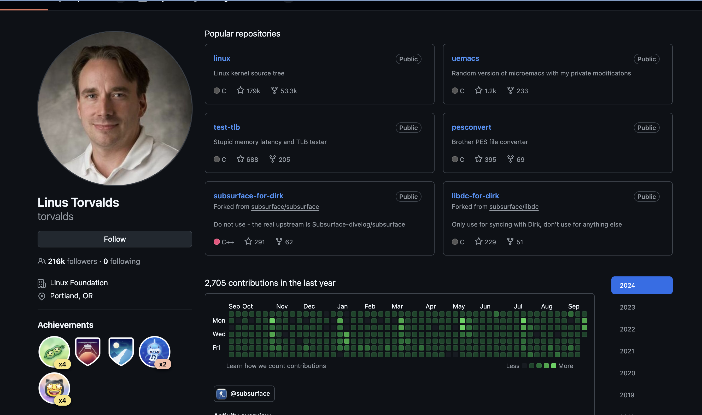
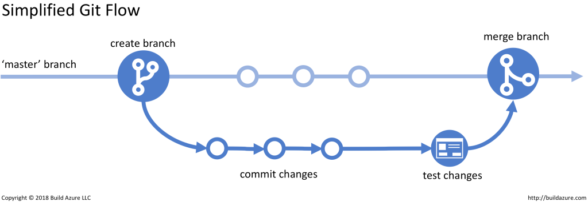

# ACTAM: Introduction to Version Control Systems

## 20/09/2024

---

## Class outline

- Short introduction (~20 min)
- Short Github demo (~10 min)
- **Hands-on:** Setup and play with first GitHub account (~30 min)

- Coffee/tea (~10 min)

- Short demo using Git (~10 min)
- **Hands-on:** Solo repo (~20 min)
- **Hands-on:** Collab repo (∞)

---

## Mindset

- All backgrounds are welcomed! (mine too)
- Collaborative approach
- Having fun == Learning
- Questions shall be asked (llms and/or me)  

---

## Magic goals

- To do many things at once (non-linear development)
- To go back in history
- To undo mistakes
- To keep control 

---

## Version/Source control of what?

- Folders, documents, codebases...a song?
- Markdown!

---

# This
## is
### the markdown syntax
_for code snippets:_
```
console.log("I love markdown")
``` 
_Explore **more** at_ [Markdown Live Preview](https://markdownlivepreview.com/).

---



---

## Types of version control

### Local
- Based on a simple database that kept track of all the changes in the files
- No collaboration: **Bad**

---


---

## Types of version control

### Centralized
- A single server that contains all the versioned files
- Entire history of the project in a single place: **bad**

---


---

## Types of version control

### Distributed (e.g Git)
- Versioned fileses are stored at different places
- Any of the client repos can be copied back up to the server to restore it: **good**

---


---



---

## Many Git powers to achieve magic goals

- **start a working area:** *git add* | *git clone*

- **mess around:** *git add* | *git mv* | *git rm*

- **examine history and state:** *git status* | *git log* | *git diff*

- **make and modify history:** *git commit* | *git branch* | *git merge*

- **collaborate:** *git fetch* | *git pull* | *git push*

---

## Memo 1: Adding vs Committing

- *git add*: stages changes (new, modified, or deleted files) in the **staging area** preparing them for a commit
- *git commit*: records the staged changes into the repo's history, creating **a snapshot of the current state** of the project.

---

## Memo 2: Fetching vs Pulling

- *git fetch*: retrieves updates from a remote repo **without altering the local working directory**
- *git pull*:  retrieves updates from a remote repo and then **integrate with another repo or a local branch**

---

## Memo 3: Pull request (PR) vs Merge request (MR)

Almost synonim across github and gitlab.

**A PR is a proposal to merge a set of changes from one branch into another, reviewed by team members**

---

## Memo 4:


---

## Memo 5: Tweak history

- *git checkout HEAD~3*: Temporarily go back **without removing the latest commits** ("detached HEAD")
- *git reset --soft HEAD~3*: Permanently **reset the branch** to a previous commit (and keep changes staged)
- *git checkout -b new-branch HEAD~3*: Creating a new branch from a previous commit **preserving current branch**

---

## Resources

- Dowload Git https://git-scm.com/download

- What is a pull request: https://docs.github.com/en/pull-requests/collaborating-with-pull-requests/proposing-changes-to-your-work-with-pull-requests/about-pull-requests

- For VSC lovers: https://code.visualstudio.com/docs/sourcecontrol/overview

---

## Hands-on 1: Play with GitHub

1) Create GitHub account
2) Populate a new repo with files/folders
3) Create new branch, commit some changes, inspect history
4) Pull requests and merge without conflicts
5) like before but with conflicts resolution

6) Extra: fork your deskmate's...repo!

---

## Hands-on 2: Solo local repo

1) Install Git
2) Create and initialize a local repo
3) Add and commit stuff
4) Tweak common history (3 methods above)

5) Extra: try merge changes from new-branch into main (*git merge new-branch*)

---

## Hands-on 3: Collab on a remote repository

1) Group in 2-4 people 
2) Imagine a mockup project (app, library, book)
3) Assign tasks (devs, maintainers)
4) Create and clone remote repo 
5) Pull and Push to branches (2-3 iterations)
6) Create and review pull requests for merging changes
7) Final goal: a clean, functional main branch

---