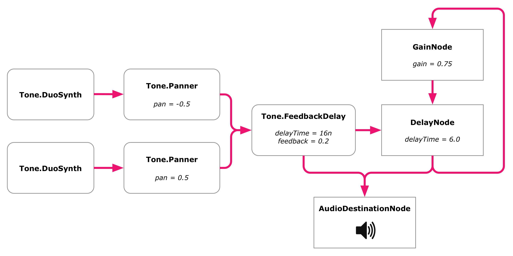

# ACTAM: Tools for Audio Programming in the browser
## 13/11/2024

---

## Re-cap Web Audio API

---

## But how can we get to a DAW level?

TONE.JS!

[Check this out!](https://tonejs.github.io/examples/daw)

---

## What is tone.js? Who is it for?

- A Web Audio framework for web-based applications
- Both for musicians and audio programmers (no execuses!)

---

## Tone.js builds on top of the Web Audio API

---

## Main difference? Less boilerplate code!

- higher-level constructs (e.g. pre-built Synth, Sampler, Sequencer)
- pre-built instruments and effects
- built-in *Transport* to handle timing (e.g. schedule future events)
- MIDI data support

---

## Example: Play a middle C note for 1 second

### Web Audio Api
`const audioC = new window.AudioContext`
`const osc= audioC.createOscillator()` 
`const gainN = audioContext.createGain()`
`osc.type = 'sine'` 
`osc.frequency.setValueAtTime(261.63, audioC.currentTime)` 
`osc.connect(gainN).connect(audioC.destination);`
`osc.start()`
`gainN.gain.setValueAtTime(1, audioC.currentTime)`
`gainN.gain.exponentialRampToValueAtTime(0.001, audioC.currentTime + 1)` 
`osc.stop(audioContext.currentTime + 1)`

---

## Example: Play a middle C note for 1 second

### Tone.js
`const synth = new Tone.Synth().toDestination()`
`synth.triggerAttackRelease("C4", "8n")` 

---

## How can I get and host it?

1) Get Node.js from https://nodejs.org/en/download/package-manager
2) Go to terminal: `npm install tone`

or 

- Use Content Delivery Network to import tone.js directly in html:
For example: https://cdnjs.cloudflare.com/ajax/libs/tone/14.8.49/Tone.js

---

## Where can I learn all about its APIs?

https://tonejs.github.io/docs/15.0.4/index.html

Relationship between the AudioContext time and the Transport's time here:
https://github.com/Tonejs/Tone.js/wiki/TransportTime

---

